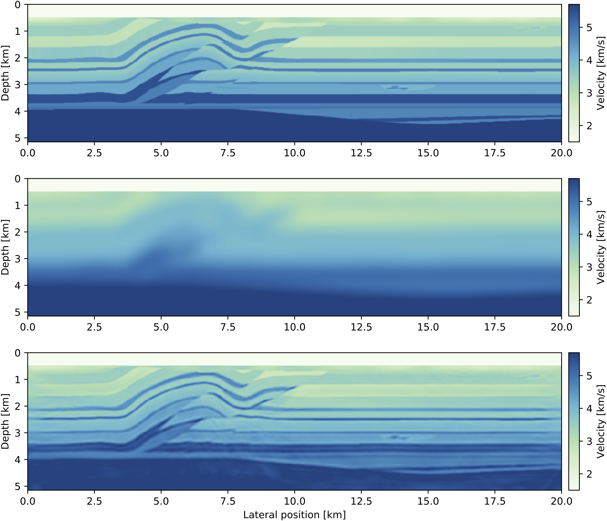

## Introduction

This tutorial is the third part of a full-waveform inversion (FWI) tutorial series with a step-by-step walkthrough of setting up forward and adjoint wave equations and building a basic FWI inversion framework. For discretizing and solving wave equations, we use Devito, a Python domain-specific language for automated finite-difference code generation [@lange2016dtg]. The first two parts of this tutorial [@louboutin2017fwi; @louboutin2017bfwi] demonstrated how to solve the acoustic wave equation for modeling seismic shot records and how to compute the gradient of the FWI objective function through adjoint modeling. With these two key ingredients, we will now build an inversion framework for minimizing the FWI least-squares objective function.

Full-waveform inversion is a very challenging problem from the optimization perspective, since not only do we need to solve expensive wave equations for a large number of source positions and iterations, but the FWI objective function is also non-convex, which means there exist (oftentimes many) local minima and saddle points. Furthermore, the problem is ill-posed and it is generally not possible to uniquely recover the parametrization of the subsurface from the given data alone, making FWI an active field of research [e.g. @vanleeuwen2013; @warner2014; @Peters2017]. This tutorial will demonstrate how we can set up a basic FWI framework with gradient-based optimization algorithms, such as the steepest descent, non-linear conjugate gradient or Gauss-Newton method [@nocedal2006]. Since building a full FWI framework with routines for data IO and parallelization is outside the scope of a single tutorial, we will implement our inversion framework with jSeis, a parallel software package in Julia for seismic modeling and inversion. jSeis provides mathematical abstractions and functions wrappers that allow to implement FWI and least-squares migration algorithms that closely follow the mathematical notation, while using Devito's automatic code generation for solving the underlying wave equations.

## Optimizing the full-waveform inversion objective function

In the previous tutorial, we demonstrated how to calculate the gradient of the FWI objective function with the $\ell_2$-misfit:

```math {#FWI}
	\mathop{\hbox{minimize}}_{\mathbf{m}} \hspace{.2cm} \Phi(\mathbf{m})= \sum_{i=1}^{n_s} \frac{1}{2} \left\lVert \mathbf{d}^\mathrm{pred}_i (\mathbf{m}, \mathbf{q}) - \mathbf{d}_i^\mathrm{obs} \right\rVert_2^2,
```

where $\mathbf{d}^\mathrm{pred}_i$ and $\mathbf{d}^\mathrm{obs}_i$ are the predicted and observed seismic shot records of the $i$th source location and $\mathbf{m}$ is the velocity model in squared slowness. As mentioned in the introduction, this objective function is non-convex, with its properties depending on many physical and environmental factors, such as the acquisition geometry, the geology of the target area and frequency content of the observed data. The most straight-forward approach for optimizing the FWI objective function is with local (gradient-based) optimization methods. Unlike numerically very expensive global methods, local methods find a minimum in vicinity of the starting point, with no guarantee that the solution is in fact the global minimum. The success of FWI therefore relies heavily on the initial guess, i.e. on the accuracy of the starting model. Initial velocity models that generate predicted shot records of which the events are shifted by more than half a wavelength, widely referred to as cycle skipping, cause local optimization algorithms to converge to local minima. Despite these issues, local gradient-based optimization algorithms are still the most widely used methods in practice, due to their relative simplicity.

Algorithm #basic_fwi outlines the basic structure of gradient-based full-waveform inversion. The first step is a loop over the total number of source positions, in which we compute the predicted data $\mathbf{d}_k^\mathrm{pred}$ for the $k^{th}$ source location, as well as the function value $f$ and the gradient $\mathbf{g}$. The operator $\mathcal{F}(\mathbf{m}, \mathbf{q}_k)$ denotes the forward modeling scheme for the current model $\mathbf{m}_0$ and source $\mathbf{q}_k$, as presented in the first part of this tutorial seriers [@louboutin2017fwi]. Calculating the gradient as described in the second tutorial [@louboutin2017bfwi], can be expressed as the action of a linear operator $\nabla \mathcal{F}^\top$ that acts on the data residual. The operator $\nabla \mathcal{F}$ is the partial derivative of the forward modeling operator and commonly known as the Jacobian or demigration operator and its adjoint $\nabla \mathcal{F}^\top$ is the (reverse-time) migration operator (e.g. Symes). 


#### Algorithm: {#basic_fwi}
| Input: observed data $\mathbf{d}^\mathrm{obs}$, source wavelets $\mathbf{q}$, initial model $\mathbf{m}_0$
| **for** \ ``j=1 \text{ to } n_{iter}``
| 		# function value and gradient for $n_s$ source positions
| 		$f = 0, \mathbf{g} = \mathbf{0}$
| 		**for** \ ``k=1 \text{ to } n_{s}``
|				$\mathbf{d}^\mathrm{pred}_k = \mathcal{F}(\mathbf{m}_0, \mathbf{q}_k)$
|				$f = f + \frac{1}{2} \| \mathbf{d}^\mathrm{pred}_k - \mathbf{d}^\mathrm{obs}_k \|^2_2$
|				$\mathbf{g} = \mathbf{g} + \nabla \mathcal{F}^\top \Big( \mathbf{d}^\mathrm{pred}_k - \mathbf{d}^\mathrm{obs}_k \Big)$
| 		**end**
|		# Find search direction and update model
|		$\mathbf{p}_j = -\mathbf{D}\mathbf{g}$
|		$\mathbf{m}_0 = \mathbf{m}_0 + \alpha \mathbf{p}_j$
| **end**
: Basic structure of gradient-based full-waveform inversion algorithms. The matrix $\mathbf{D}$ is defined by the particular optimization algorithm and we have $\mathbf{D}=\mathbf{I}$ for steepest descent, $\mathbf{D}=\mathbf{H}^{-1}$ for Newton's method or $\mathbf{D}=(\nabla \mathcal{F}^\top \nabla \mathcal{F})^{-1}$ for the Gauss-Newton method.

To update the velocity model,  we need to find a search direction $\mathbf{p}_j$, which for gradient-based optimization is the negative gradient multiplied with a positive semi-definit matrix $\mathbf{D}$. The matrix can be thought of as a scaling operator that weights individual parts of the gradient and is defined by the optimization algorithm. In the simplest case we have $\mathbf{D} = \mathbf{I}$, where $\mathbf{I}$ is the identity matrix (steepest descent). When the objective function can be well approximated by a quadratic, $\mathbf{D}$ can also be chosen to be the inverse hessian (Newton's method) or one of its approximations (Gauss-Newton and Quasi-Newton methods) [@nocedal2006]. The step length $\alpha$ is a scalar that determines how far we move along the search direction $\mathbf{p}_k$ and is equal to one for Newton's method. For all other methods, $\alpha$ has to be determined with an (inexact) line search, so that updating the model with $\mathbf{m}_0 + \alpha \mathbf{p}_j$ leads to a decrease of the FWI function value. 

## The jSeis framework for modeling and inversion

For implementing our full-waveform inversion examples, we will use jSeis, a parallel seismic inversion framework in Julia. The underlying wave equations are set up and solved using Devito and the Python code is interfaced from Julia using the PyCall package [@Johnson2017]. jSeis provides a set of matrix-free linear operators for forward and time reversal modeling, as well as source/receiver projections and migration/demigration operators that encapsulate the wave equation solvers. We will demonstrate the basic functionalities of jSeis using a small test data set that was generated with the 2D Overthrust velocity model. 

We start by downloading the velocity model and the data set, which consists of 97 shot records. For reading and writing SEG-Y data, jSeis uses the SeisIO package [@lensing2017], a sophisticated SEG-Y reader that allows to scan large 3D data sets for creating look-up tables with header summaries. However, since our data set is relatively small, we will directly load the full file into memory. The `segy_read` command takes the file name as an input and returns a dense data block, from which we construct a jSeis vector for the observed data:

```julia
  using seisIO, jSeis
  block = segy_read("overthrust_2d_shots.segy")
  d_obs = joData(block)
```

The `d_obs` object is an abstract vector that can be used like a regular Julia vector, i.e. we can compute `norm(d_obs)` or `dot(d_obs, d_obs)`, but it contains the shot records in their original dimension, which prevents repeated vectorizing and reshaping of data. Shot records can be accessed via their respective shot number with `d_obs.data[shot_no]`, while the header information can be accessed with `d_obs.geometry`. Since a seismic SEG-Y file contains the source coordinates, but not the source wavelet itself, we extract the source geometry from our file and then manually set up a source vector `q` with a 15 Hertz Ricker wavelet:

```julia
  src_geometry = Geometry(block)
  src_data = ricker_wavelet(src_geometry.t[1], src_geometry.dt[1], 0.015)
  q = joData(src_geometry, src_data)
```

Since our data set consists of 97 shot records, both `d_obs` and `q` contain the data and geometries for all source positions. We can check the number of source positions with `d_obs.nsrc` and `q.nsrc` and we can extract the part of the vector that corresponds to one or multiple shots with `d_obs[shot_no], q[shot_no]`. Having set up vectors for the observed data and sources, we can now construct matrix-free linear operators for wave equations and gradients. This will allow us to express modeling a shot record as `d_pred = Pr*F*Ps'*q`, where `Pr` and `Ps` are matrix-free operators around the Devito sparse point injection and interpolation [@louboutin2017fwi] and `F` is the inverse of the acoustic wave equation. Multiplications with `Ps` and `Pr` represent sampling the wavefield at source/receiver locations, while their adjoints `Pr', Ps'` denote injecting either shot records or source wavelets. Since the dimensions of the inverse wave equation operator depend on the number of computational time steps, we calculate this number using the `get_computational_nt` function and set up an `info` object that contains some dimensionality information required by all operators. The projection and modelling operators can then be set up in Julia in the following way:

```julia
  ntComp = get_computational_nt(q.geometry, d_obs.geometry, model0)
  info = Info(prod(model0.n), d_obs.nsrc, ntComp)
  Pr = joProjection(info, d_obs.geometry)
  Ps = joProjection(info, q.geometry)
  F = joModeling(info, model)
```

We can forward model all 97 predicted shot records by typing `d_pred = Pr*F*Ps'*q` into the Julia terminal. If we started our Julia session with more than one worker, the wave equation solves are parallelized over source locations and all shots are collected in the `d_pred` vector. We can also model a single or subset of shots by indexing the operators with the respective shot numbers. E.g. if we want to model the first two shots, we define `i=[1,2]` and then run `d_sub = Pr[i]*F[i]*Ps[i]'*q[i]`. Accordingly, if we want to solve an adjoint wave equation with the observed data as the adjoint source and restrictions of the wavefields back to the source locations, we can run `qad = Ps*F'*Pr'*d_obs`. Furthermore, jSeis allows to create a linearized modeling operator `J` from a forward modeling operator and a specified source vector. As mentioned, this operator is also known as the Jacobian or demigration operator and its adjoint `J'` is the migration or gradient operator. In Julia we can set up the Jacobian and compute the FWI gradient for one source location in the following way:

```julia
  J = joJacobian(Pr*F*Ps',q)
  i = 10	# choose shot no. 10
  d_pred = Pr[i]*F[i]*Ps[i]'*q[i]
  g = J[i]'*(d_pred - d_obs[i])
```

One draw back of this notation, is that the forward wavefields for the gradient calculation have to be recomputed, since the forward modeling operator only returns the shot records and not the wavefields. For this reason, jSeis has an additional function for computing the gradients of the FWI objective function `f,g = fwi_objective(model,q[i],d_obs[i])`, which takes the current model, source and data vectors as an input and computes the function value and gradient in parallel and without having to recompute the forward wavefields.


## Full-waveform inversion with jSeis

With expressions for modeling operators, Jacobians and gradients of the FWI objective, we can now implement several different FWI algorithms in a few lines of code. We will start with a basic gradient descent (GD) example with a line search, as outlined in Algorithm #basic_fwi, but including two minor modifications. To reduce the computational cost of full gradient descent (GD), we will use a stochastic approach in which we only compute the gradient and function value for a randomized subset of source locations. In jSeis, this is accomplished by choosing a random vector of integers between 1 and 97 and indexing the data vectors as described earlier. The second modification is applying bound constraints to the updated model, to prevent velocities (or squared slownesses) to become negative or too large. Bound constraints are applied to the updated model trough a projection operator `proj(x)`, which clips values of the slowness that exceed their allowed range. The full algoritm for FWI with stochastic gradient descent and bound constraints is implemented as follows:

```julia
maxiter = 20
batchsize = 10	# number of shots for each iteration
proj(x) = reshape(median([vec(mmin), vec(x), vec(mmax)]), model.n)

for j=1:maxiter
	
	# FWI objective function value and gradient
	i = randperm(d_obs.nsrc)[1:batchsize]	# select random source locations
	fval, grad = fwi_objective(model0, q[i], d_obs[i])

	# line search and update model
	alpha = backtracking_linesearch(model0, q[i], dobs[i], fval, grad, proj; alpha=1f-6)
	model.m += reshape(-alpha*grad, model0.n)

	# apply bound constraints
	model.m = proj(model0.m)
end
```

The function `backtracking_linesearch` performs an approximate line search for a value of `alpha` that leads to a sufficient decrease of the FWI function value (Armijo condition) [@nocedal2006]. While the convergence rate of this algorithm depends on the objective function, it is at best linear for full GD and sub-linear for stochastic GD. Without having to compute second derivatives, this rate can be improved to super-linear with the non-linear conjugate gradient method (CG). The CG algorithm only requires additional storage of the previous gradient `g_prev` and update direction `d_prev` (both are set to zero for the first iteration). A new search direction is computed as a linear combination of the current gradient and previous search direction: $\mathbf{p}_j = -\mathbf{g}_j + \beta \mathbf{p}_{j-1}$, with $\beta$ given by one of the various CG update rules such as $\beta = \frac{\mathbf{g}_j^\top (\mathbf{g}_j - \mathbf{g}_{j-1}}{\mathbf{g}_j^\top \mathbf{g}_j}$ (Polak-Ribiere) [@nocedal2006]. In Julia, we can easily modify our previous algorithm by inserting these two lines in front of the line search (see **fwi_overthrust_cg.jl** for the full example):

```julia
  beta = dot(g, g - g_prev)/dot(g_prev, g_prev)	# Polak-Ribiere
  p = -g + beta*p_prev
```

In cases where we have already made decent progress towards the solution or start with a very good initial model, convergence can be further improved by using second order methods, i.e. algorithms that use the curvature information of the objective function, such as Newton's method or one of its derivatives. For large-scale problems such as FWI, the exact Newton's method is prohibitively expensive, since it involves computing the second derivative matrix `$\mathbf{H}$ (Hessian) and solving a linear system $\mathbf{H} \mathbf{p} = \mathbf{g}$ for obtaining a search direction. For least-squares problems, the full hessian can be approximated by the Gauss-Newton hessian $\mathbf{J}^\top \mathbf{J}$, but the matrix still needs to be inverted for finding a search direction. Since the GN hessian is ill-conditioned, it is usually preferable to solve the overdetermined linear system $\mathbf{J} \mathbf{p} = \mathbf{d}^\mathrm{pred}_k - \mathbf{d}^\mathrm{obs}_k$ instead. In practice, we only perform a few GD iteration to approximately solve the least squares subproblem. For FWI with the (truncated) GN we modify our algorithm in the following way:

```julia
# Gauss-Newton method
for j=1:maxiter

	# Model predicted data for subset of sources
    i = randperm(d_obs.nsrc)[1:batchsize]
    d_pred = Pr[i]*F[i]*Ps[i]'*q[i]
    p = zeros(Float32, info.n)
	
	# GN update direction
    for k=1:maxiter_GN
      r = J[i]*d - (d_pred - d_obs[i])
      g_gn = J[i]'*r
      t = norm(r)^2/norm(g_gn)^2
      p -= t*g_gn
    end
	
	# update model and bound constraints
    model.m = proj(model0.m - reshape(p, model.n))	# alpha=1
end
```

#### Figure: {#result_GN}
{width=80%}
: Recovered velocity model after 10 iterations of the Gauss-Newton method as shown above, with 10 iterations for the least squares subproblem.

An alternative to (Gauss-) Newton methods are Quasi-Newton methods, which build up an approximation of the Hessian from previous gradients only and require no additional PDE solves or matrix inversions. Implementing an efficient and correct version of this method, such as the L-BFGS algorithm, exceeds a few lines of code and we therefore leave this exercise to the reader. Instead of implementing more complicated algorithms by hand, it is also possible to interface third-party Julia optimization libraries and an example for this is given in the notebook **fwi_overthrust_minConf.jl**. Even though all examples shown here are two-dimensional only, jSeis can be used for 3D modeling and inversion without having to change the code, since the number of dimensions are automatically inferred from the velocity model and data dimensions.

## Conclusions

In this final part of our FWI tutorial series, we demonstrated how to set up basic optimization algorithms for waveform inversion using jSeis. The methods shown here are all gradient based and differ in the way how update directions for the velocity model are computed. Our numerical examples can serve for the reader as a basis for developing more advanced FWI workflows, which usually include additional data preprocessing, frequency continuation techniques or further model constraints.

## Installation

This tutorial is based on Devito version 3.1.0. It requires the installation of the full software with examples, not only the code generation API. To install Devito, run

	git clone -b v3.1.0 https://github.com/opesci/devito
	cd devito
	conda env create -f environment.yml
	source activate devito
	pip install -e .
 
Furthermore, users need to install the jSeis software package. To install, start a Julia session and run
 
	Pkg.add("jSeis.jl")
 
### Useful links

- [Devito documentation](http://www.opesci.org/)
- [Devito source code and examples](https://github.com/opesci/Devito)
- [Tutorial notebooks with latest Devito/master](https://github.com/opesci/Devito/examples/seismic/tutorials)


## Acknowledgments

This research was carried out as part of the SINBAD II project with the support of the member organizations of the SINBAD Consortium. This work was financially supported in part by EPSRC grant EP/L000407/1 and the Imperial College London Intel Parallel Computing Centre.

## References


