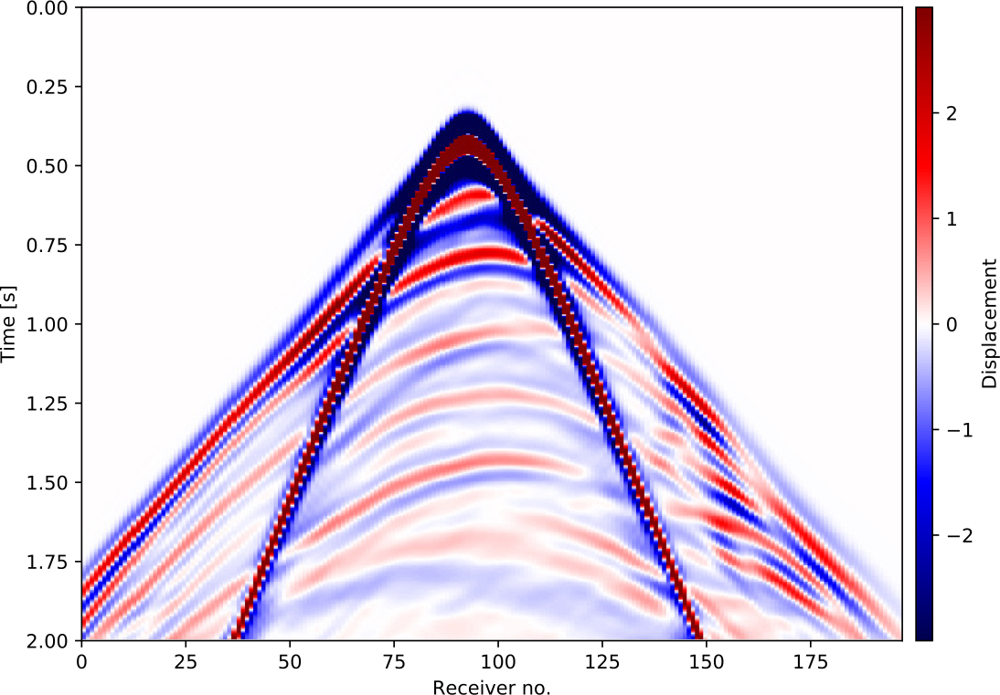
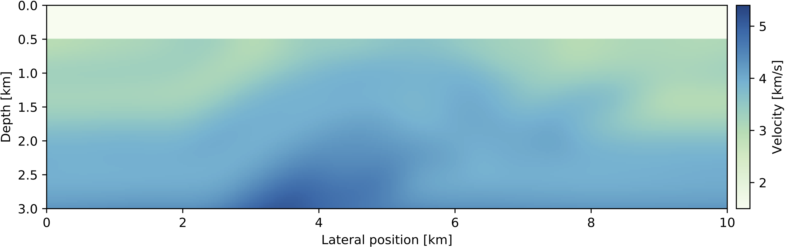
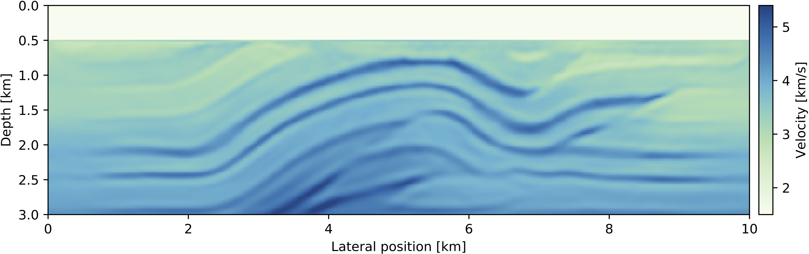
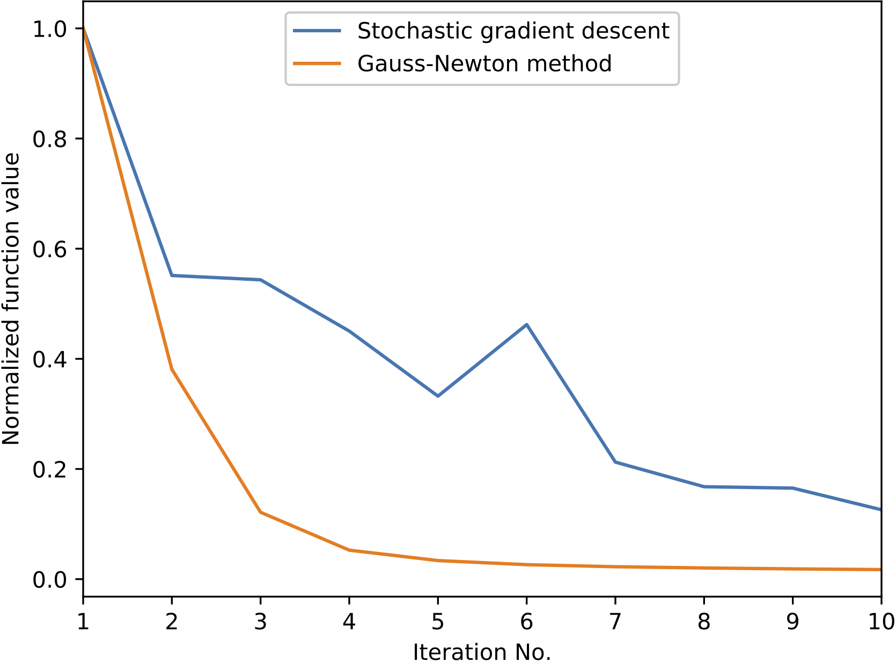

## Introduction

This tutorial is the third part of a full-waveform inversion (FWI) tutorial series with a step-by-step walkthrough of setting up forward and adjoint wave equations and building a basic FWI inversion framework. For discretizing and solving wave equations, we use [Devito], a Python domain-specific language for automated finite-difference code generation [@lange2016dtg]. The first two parts of this tutorial [@louboutin2017fwi; @louboutin2017bfwi] demonstrated how to solve the acoustic wave equation for modeling seismic shot records and how to compute the gradient of the FWI objective function through adjoint modeling. With these two key ingredients, we will now build an inversion framework for minimizing the FWI least-squares objective function.

[Devito]:http://www.opesci.org/devito-public
[Julia]:https://julialang.org
[JUDI]:https://github.com/slimgroup/JUDI.jl

Full-waveform inversion is a very challenging problem from the optimization perspective, since not only do we need to solve expensive wave equations for a large number of source positions and iterations, but the FWI objective function is known to have (oftentimes many) local minima and saddle points related to cycle skipping. Furthermore, the problem is non-unique and it is generally not possible to unambiguously recover the parametrization of the subsurface from the given data alone, making FWI an active field of research [e.g. @vanleeuwen2013; @warner2014; @Peters2017]. This tutorial demonstrates how we can set up a basic FWI framework with gradient-based optimization algorithms, such as the steepest descent and the Gauss-Newton method [@nocedal2006]. Since building a full FWI framework with routines for data IO and parallelization is outside the scope of a single tutorial, we will implement our inversion framework with the [Julia Devito Inversion framework](https://github.com/slimgroup/JUDI.jl) (JUDI), a parallel software package for seismic modeling and inversion in [Julia] [@Bezanson2012]. JUDI provides mathematical abstractions and functions wrappers that allow us to implement wave-equation based inversions such as FWI that closely follow the mathematical notation, while using Devito's automatic code generation for solving the underlying wave equations.

## Optimizing the full-waveform inversion objective function

The goal of this tutorial series is to optimize the FWI objective function with the $\ell_2$-misfit:

```math {#FWI}
	\mathop{\hbox{minimize}}_{\mathbf{m}} \hspace{.2cm} f(\mathbf{m})= \sum_{i=1}^{n_s} \frac{1}{2} \left\lVert \mathbf{d}^\mathrm{pred}_i (\mathbf{m}, \mathbf{q}_i) - \mathbf{d}_i^\mathrm{obs} \right\rVert_2^2,
```

where $\mathbf{d}^\mathrm{pred}_i$ and $\mathbf{d}^\mathrm{obs}_i$ are the predicted and observed seismic shot records of the $i^{\text{th}}$ source location and $\mathbf{m}$ is the velocity model in squared slowness. In part one, we demonstrated how to implement a forward modeling operator for generating the predicted shot records, which we will denote as $\mathbf{d}^\mathrm{pred}_i = \mathbf{F}(\mathbf{m},\mathbf{q}_i)$. 
In the second tutorial, we then showed how we can compute the gradient $\nabla f(\mathbf{m})$ of the objective function and update our initial model using gradient descent (GD). This first order optimization algorithm has at best a linear convergence rate and requires typically many iterations. For this reason, second order optimization methods are of interest, since they converge considerably faster (with up to quadratic convergence rate), assuming that the starting model $\mathbf{m}_0$ is good and there is no cycle skipping. For second order methods, we approximate the objective by a second order Taylor expansion:

```math {#Taylor}
	f(\mathbf{m}) = f(\mathbf{m}_0) + \nabla f(\mathbf{m}_0) \delta \mathbf{m} + \delta \mathbf{m}^\top \nabla^2 f(\mathbf{m}_0) \delta \mathbf{m} + \mathcal{O}(\delta \mathbf{m}^3),
```

where $\nabla f(\mathbf{m}_0)$ is the gradient as implemented in part two and $\nabla^2 f(\mathbf{m}_0)$ is the Hessian of the objective function, which we will from now on refer to as $\mathbf{H}$ (omitting the model dependence). Rather than simply using the negative gradient to update our model, we can directly calculate a model update $\delta \mathbf{m}$ that leads us to the minimum of the quadratic Taylor approximation (Newton's method):

```math {#newton}
	\delta \mathbf{m} = - \mathbf{H}(\mathbf{m}_0)^{-1} \nabla f(\mathbf{m}_0).
```

Newton's method converges very fast to the solution of the FWI objective function, but comes at the cost of having to compute and invert the Hessian matrix [@nocedal2006]. For least squares problems, such as FWI, the Hessian can be approximated by the Gauss-Newton (GN) Hessian $\mathbf{J}^\top \mathbf{J}$, where $\mathbf{J}$ is the Jacobian matrix, which is the partial derivative of the forward modeling operator $\mathbf{F}(\mathbf{m},\mathbf{q})$ with respect to $\mathbf{m}$. The Jacobian can also be used to express the gradient of the FWI objective function as $\nabla f(\mathbf{m}_0) = \mathbf{J}^\top (\mathbf{d}^\mathrm{pred}_i - \mathbf{d}_i^\mathrm{obs})$, where $\mathbf{J}^\top$ is the adjoint (transposed) Jacobian. This is useful, because we now have a set of operators $\mathbf{F}, \mathbf{J}$ and $\mathbf{H}_{GN}=\mathbf{J}^\top\mathbf{J}$, through which we can express both first and second order optimization algorithms for FWI. However, forming these matrices explicitly is not possible, since they can become extremely large. Luckily, we only need the action of these operators on vectors, which allows us to implement these operators matrix-free. In the following section we will demonstrate how to set up these operators in our JUDI software framework and to how to use them for implementing FWI algorithms.

## The Julia Devito Inversion framework and SeisIO

[SeisIO]:https://github.com/slimgroup/SeisIO.jl

The Julia Devito Inversion framework is a parallel matrix-free linear operator library for seismic modeling and inversion based on Devito and [SeisIO], a performant Julia package for reading and writing large data volumes in SEG-Y format. JUDI allows us to implement seismic inversion algorithms as linear algebra operations, enabling rapid translations of FWI algorithms to executable Julia code. The underlying wave equations are set up and solved using Devito, as described in the first two tutorials, and are interfaced from Julia using the [PyCall](https://github.com/JuliaPy/PyCall.jl) package [@Johnson2017]. 

We start our demonstration by reading the initial model and our data set, which consists of $31$ shot records and was generated with an excerpt from the 2D Overthrust model. For reading and writing SEG-Y data, JUDI uses the SeisIO package, a sophisticated SEG-Y reader that allows us to scan large 3D data sets for creating look-up tables with header summaries. However, since our data set is relatively small, we will directly load the full file into memory. The `segy_read` command takes the file name as an input and returns a dense data block, from which we construct a JUDI vector for the observed data:

```julia
  block = segy_read("overthrust_2d_shots.segy")
  d_obs = judiVector(block)
  imshow(d_obs.data[15])
```

#### Figure: {#observed_data}
{width=60%}
: Observed shot record number 15.

The `d_obs` object is an abstract vector, which can be used like a regular Julia vector so we can compute norms via `norm(d_obs)` or the inner product via `dot(d_obs, d_obs)`. The vector `d_obs` looks like a vectorized version of the seismic data, but contains the shot records in their original dimension. Shot records can be accessed via their respective shot number with `d_obs.data[shot_no]`, while the header information can be accessed with `d_obs.geometry`. Since a SEG-Y file contains the source coordinates, but not the source wavelet itself, we extract the source geometry from our file and then manually set up a source vector `q` with a $8$ Hertz Ricker wavelet:

```julia
  src_geometry = Geometry(block)
  src_data = ricker_wavelet(src_geometry.t[1], src_geometry.dt[1], 0.008)
  q = judiVector(src_geometry, src_data)
```

Since our data set consists of $31$ shot records, both `d_obs` and `q` contain the data and geometries for all source positions. We can check the number of source positions with `d_obs.nsrc` and `q.nsrc` and we can extract the part of the vector that corresponds to one or multiple shots with `d_obs[shot_no], q[shot_no]`. 

We will now set up the forward modeling operator $F(\mathbf{m},\mathbf{q})$ in terms of matrix-free operators for the inverse wave equation $\mathbf{A}(\mathbf{m})^{-1}$, where $\mathbf{m}$ is the current model, and source/receiver injection and sampling operators $\mathbf{P}_s$ and $\mathbf{P}_r$. This allows us to express modeling of a shot record as `d_pred = Pr*Ainv*Ps'*q`. The `Pr` and `Ps` can be considered as matrix-free operators around the Devito sparse point injection and interpolation [@louboutin2017fwi]. Multiplications with `Ps` and `Pr` represent sampling the wavefield at source/receiver locations, while their adjoints `Pr', Ps'` denote injecting either shot records or source wavelets into the computational grid. Since the dimensions of the inverse wave equation operator depend on the number of computational time steps, we calculate this number using the `get_computational_nt` function and set up an `info` object that contains some dimensionality information required by all operators. The projection and modelling operators can then be set up in Julia in the following way:

```julia
  ntComp = get_computational_nt(q.geometry, d_obs.geometry, model0)
  info = Info(prod(model0.n), d_obs.nsrc, ntComp)
  Pr = judiProjection(info, d_obs.geometry)
  Ps = judiProjection(info, q.geometry)
  Ainv = judiModeling(info, model0)
```

We can forward model all 31 predicted shot records by running `d_pred = Pr*Ainv*Ps'*q` from the Julia command line, which is equivalent to the mathematical expression $F(\mathbf{m};\mathbf{q})=\mathbf{P}_r\mathbf{A}^{-1}(\mathbf{m})\mathbf{P}_s^\top\mathbf{q}$ by virtue of the instantiation `Ainv = judiModeling(info, model0)`, which makes the wave equation solver implicitly dependent on the `model`. If we started our Julia session with multiple CPU cores or nodes, the wave equation solves are automatically parallelized over source locations and all shots are collected in the `d_pred` vector. We can also model a single or subset of shots by indexing the operators with the respective shot numbers. E.g. if we want to model the first two shots, we define `i=[1,2]` and then run `d_sub = Pr[i]*Ainv[i]*Ps[i]'*q[i]`. **Remark.** If we want to solve an adjoint wave equation with the observed data as the adjoint source and restrictions of the wavefields back to the source locations, we can {++ simply ++} run `qad = Ps*Ainv'*Pr'*d_obs`, exemplifying the advantages of casting FWI in a proper computational linear algebra framework.

Finally, we set up the matrix-free Jacobian operator `J` and the Gauss-Newton Hessian `J'*J`. As mentioned in the introduction, `J` is the partial derivative of the forward modeling operator, so `J` is directly constructed from our modeling operator `Pr*Ainv*Ps'` and a specified source vector `q`:

```julia
  J = judiJacobian(Pr*Ainv*Ps',q)
  H_GN = J'*J    # Gauss-Newton Hessian
  i = 10	# choose shot no. 10
  d_pred = Pr[i]*Ainv[i]*Ps[i]'*q[i]
  g = J[i]'*(d_pred - d_obs[i])    # FWI gradient
```

In the context of seismic inversion, the Jacobian is also called the linearized modeling or demigration operator and its adjoint `J'` is the migration operator. One draw back of this notation is, that the forward wavefields for the gradient calculation have to be recomputed, since the forward modeling operator only returns the shot records and not the complete wavefields. For this reason, JUDI has an additional function for computing the gradients of the FWI objective function `f,g = fwi_objective(model0,q[i],d_obs[i])`, which takes the current model, source and data vectors as an input and computes the objective value and gradient in parallel and without having to recompute the forward wavefields.

## Full-waveform inversion with JUDI

With expressions for modeling operators, Jacobians and gradients of the FWI objective, we can now implement different FWI algorithms in a few lines of code. We will start with a basic gradient descent (GD) example with a line search. To reduce the computational cost of full gradient descent (GD), we will use a stochastic approach (SGD) in which we only compute the gradient and function value for a randomized subset of source locations. In JUDI, this is accomplished by choosing a random vector of integers between 1 and 31 and indexing the data vectors as described earlier. Furthermore, we will apply bound constraints to the updated model, to prevent velocities (or squared slownesses) to become negative or too large. Bound constraints are applied to the updated model trough a projection operator `proj(x)`, which clips values of the slowness that exceed their allowed range. The full algoritm for FWI with stochastic gradient descent and bound constraints is implemented as follows:

```julia
maxiter = 20
batchsize = 10	# number of shots for each iteration
proj(x) = reshape(median([vec(mmin) vec(x) vec(mmax)],2), model0.n)

for j=1:maxiter
	
	# FWI objective function value and gradient
	i = randperm(d_obs.nsrc)[1:batchsize]	# select random source locations
	fval, grad = fwi_objective(model0, q[i], d_obs[i])

	# line search and update model
	update = backtracking_linesearch(model0, q[i], d_obs[i], fval, grad, proj; alpha=1f0)
	model0.m += reshape(update, model0.n)

	# apply bound constraints
	model0.m = proj(model0.m)
end
```

The function `backtracking_linesearch` performs an approximate line search and returns a model update that leads to a sufficient decrease of the FWI function value (Armijo condition) [@nocedal2006]. The result after 10 iterations of SGD with bound constraints is shown in Figure #result_SGD . In practice, where starting models are typically less accurate than in our example, FWI is often performed from low to high frequencies, since the objective function has less local minima for lower frequencies [@bunks1995]. In this multi-scale FWI approach, a low-pass filtered version of the data is used to invert for a low resolution velocity model first and higher frequencies are added in subsequent iterations.

#### Figure: {#result_SGD}
{width=80%} \
{width=80%}
: Initial model and recovered velocity model after 10 iterations of stochastic gradient descent with bound constraints and a batch size of 10 shots.

As discussed earlier, the convergence rate of GD depends on the objective function, but is at best linear for full GD and sub-linear for stochastic GD, making many FWI iteration necessary to reach an acceptable solution. Using our matrix-free operator for the Jacobian `J`, we can modify the above code to implement the Gauss-Newton method (Equation #newton) to improve the convergence rate. In practice, directly inverting the Gauss-Newton Hessian `J'*J` should be avoided, because the matrix is badly conditioned and takes many iterations to invert. Instead, we perform a few iterations of `LSQR` to approximately invert the Jacobian `J`. `LSQR` is a conjugate-gradient type algorithm for solving least squares problems and is mathematically equivalent to inverting `J'J`, but has better numerical properties [@paige1982]. In Julia, we implement the Gauss-Newton method with `LSQR` as follows:

```julia
# Gauss-Newton method
for j=1:maxiter

	# Model predicted data 
	d_pred = Pr*Ainv*Ps'*q
		
	# GN update direction
	p = lsqr(J, d_pred - d_obs; maxiter=8)
	
	# update model and bound constraints
	model0.m = proj(model0.m - reshape(p, model0.n))	# alpha=1
end
```

An important benefit of matrix-free operators is that we do not need to implement our own `LSQR` solver, but can pass `J` and the data residual `d_pred - d_obs` to a third-party optimization library. The operator `J` does not need to be an explicit matrix, since `LSQR` only uses matrix-vector products. However, in contrast to our SGD algorithm, we use all shot records in every iteration, since stochastic methods for second order algorithms are less well understood, making this approach considerably more expensive than our previous algorithm.

#### Figure: {#result_GN}
{width=80%}
: Recovered velocity model after 10 iterations of the Gauss-Newton method as shown above, with 8 iterations of `LSQR` for the GN subproblem and using all shots in every iteration.

#### Figure: {#convergence}
{width=50%}
: Normalized function values for the FWI inversion example with stochastic gradient descent and the Gauss-Newton method.

An alternative to (Gauss-) Newton methods are Quasi-Newton methods, which build up an approximation of the Hessian from previous gradients only and require no additional PDE solves or matrix inversions. Implementing an efficient and correct version of this method, such as the L-BFGS algorithm, exceeds a few lines of code and we therefore leave this exercise to the reader. Instead of implementing more complicated algorithms by hand, it is also possible to interface third-party Julia optimization libraries and an example for this is given in the notebook **fwi_overthrust_minConf.jl**. Even though all examples shown here are two-dimensional only, JUDI can be used for 3D modeling and inversion without having to change the code, since the number of dimensions are automatically inferred from the velocity model and data dimensions.

## Conclusions

In this final part of our FWI tutorial series, we demonstrated how to set up basic optimization algorithms for waveform inversion using JUDI. The methods shown here are all gradient based and differ in the way how update directions for the velocity model are computed. Our numerical examples can serve for the reader as a basis for developing more advanced FWI workflows, which usually include additional data preprocessing, frequency continuation techniques or further model constraints.

## Installation

This tutorial is based on Devito version 3.1.0. It requires the installation of the full software with examples, not only the code generation API. To install Devito, run

	git clone -b v3.1.0 https://github.com/opesci/devito
	cd devito
	conda env create -f environment.yml
	source activate devito
	pip install -e .
 
Furthermore, users need to install the [JUDI] software package, [JOLI](https://github.com/slimgroup/JOLI.jl) and [SeisIO]. These packages can be downloaded using the Julia package manager. From the Julia terminal run:
 
	Pkg.clone("https://github.com/slimgroup/SeisIO.jl.git")
	Pkg.clone("https://github.com/slimgroup/JOLI.jl.git")
	Pkg.clone("https://github.com/slimgroup/JUDI.jl.git")

 
### Useful links

- [Devito documentation](http://www.opesci.org/)
- [Devito source code and examples](https://github.com/opesci/Devito)
- [Tutorial notebooks with latest Devito/master](https://github.com/opesci/Devito/examples/seismic/tutorials)


## Acknowledgments

This research was carried out as part of the SINBAD II project with the support of the member organizations of the SINBAD Consortium. This work was financially supported in part by EPSRC grant EP/L000407/1 and the Imperial College London Intel Parallel Computing Centre.

## References


