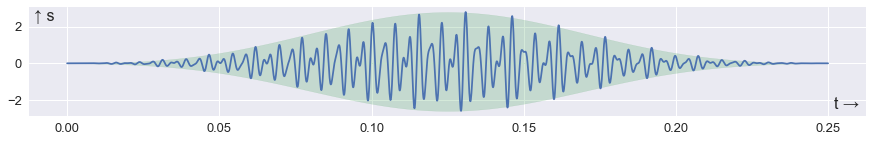
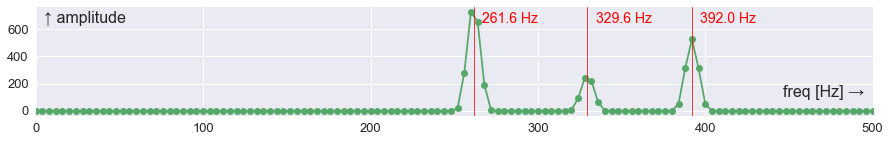
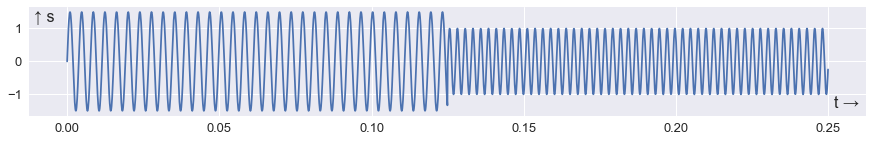
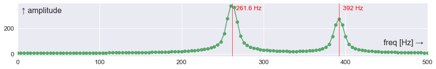
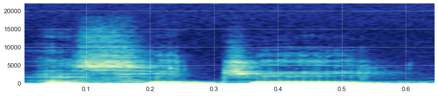

### GEOPHYSICAL TUTORIAL, June 2018

# Time-frequency decomposition

### by Matt Hall, Agile Scientific, matt@agilescientific.com

Signals can be simple functions of time _t_. A sine wave _s_ with some amplitude _a_ and at some frequency _f_ is given by:

$$ s(t) = a \sin(2 \pi f t) $$

We can implement this as a Python function. Since computers live in a discrete world, we'll need to evaluate the function over some duration and at some sampling rate:


```python
def sine_wave(f, a, duration, sample_rate):
    t = np.arange(0, duration, 1/sample_rate)
    return a * np.sin(2 * np.pi * f * t), t
```

We can now call this function, passing it a frequency _f_ = 261.63 Hz. We'll ask for 0.25 seconds, with a sample rate of 10 kHz. 


```python
s, t = sine_wave(f=261.63,
                 a=1,
                 duration=0.25,
                 sample_rate=10e3)
```

This results in the following signal, commonly called a _time series_, which we visualize by plotting _s_(_t_) against time _t_:


When air vibrates at this frequency, we hear a middle C, or C<sub>4</sub>. You can hear the note for yourself in the Jupyter Notebook accompanying this article at https://github.com/seg/tutorials-2018 (the notebook also contains all the code for making the plots). The code to render the tone as audio is very short:


```python
from IPython.display import Audio

fs = 10e3
Audio(s, rate=fs)
```

This signal is only 0.25 seconds long and there are a lot of wiggles. We'd love to have seismic at this frequency. Most seismic data is only played on the lower 20 to 30 keys of an 88-key piano — indeed, the lowest note is A<sub>0</sub> at 27.5 Hz, above the peak frequency of many older surveys.

If we wanted to know the frequency of this signal, we could assume that it's a pure tone and simply count the number of cycles per unit time. But natural signals are rarely monotones — let's use our function to make the C-major chord with 3 notes, C<sub>4</sub>, E<sub>4</sub>, and G<sub>4</sub> by passing column vectors for frequency and amplitude:


```python
f = np.array([261.6, 329.6, 392.0])
a = np.array([1.5, 0.5, 1])
s, t = sine_wave(f=f.reshape(3, 1),
                 a=a.reshape(3, 1),
                 duration=0.25,
                 sample_rate=10e3)
```

The result is a set of three sine curves 0.25 seconds long:


The total signal is given by the sum of the three curves:


```python
s = np.sum(s, axis=0)
```


## The Fourier transform

Although this mixed or _polytonic_ signal is just the sum of three pure tones, it is no longer a trivial matter to figure out the components. This is where the Fourier transform comes in.

We won't go into how the Fourier transform works — for what it's worth, the best explanation I've seen recently is [the introductory video](https://www.youtube.com/watch?v=spUNpyF58BY) by Grant Sanderson (3Blue1Brown on YouTube). The point is that the transform can be seen as describing signals as mixtures of periodic components. Let's try it out on our chord.

First we _taper_ the signal by multiplying it by a _window_ function. Pure tones theoretically have infinite duration, and the tapering helps prevent the edges of the signal from interfering with the Fourier transform. 


```python
s = s * np.blackman(s.size)
```

The window function (green) has a tapering effect on the signal:





Because the function _s_ is defined for a given moment in time _t_, we call this representation of the signal the time domain.

NumPy's fast Fourier transform function `fft()` takes the signal _s_(_t_) and returns a new representation of the signal, _S_(_f_) (sometimes also called $\hat{s}(f)$. This new representation is called the frequency domain. It consists of an array of _Fourier coefficients_:


```python
S = np.fft.fft(s)
```

A helper function, `fftfreq()`, returns the array of frequencies corresponding to the coefficients. The frequency sample interval is determined by the duration of the signal _s_: the longer the signal, the smaller the frequency sample interval. (Similarly, short sample intervals in time correspond to broad bandwidth in frequency.)


```python
freq = np.fft.fftfreq(s.size, d=1/10e3)
```

The result is an array of _Fourier coefficients_, most of which are zero. But at and near the frequencies in the chord, the coefficients are large. The result: a 'recipe' for the chord, in terms of sinusoidal monotones.





This is called the _spectrum_ of the signal _s_. It shows the magnitude of each frequency component.

## Time-frequency representation

We now know how to unweave polytonic signals, but let's introduce another complication &mdash; signals whose components change over time. Such signals are said to be _nonstationary_. First, think of a montonic signal whose tone changes at some moment (see the Notebook for the code that generates this signal):





We can compute the Fourier transform of this signal, just as before:


```python
s *= np.blackman(s.size)
S = np.fft.fft(s)
freq = np.fft.fftfreq(s.size, d=1/10e3)
```

And plot amplitude against frequency:


It looks very similar to the spectrum we made before by surgically removing the middle frequency. The peaks are a bit more spread out because the duration of each waveform is half what it was (the general uncertainty principle spreads signals out in frequency as they become more compact in time).

The point is that there's not much difference between the spectrum of two mixed signals, and the spectrum of two consecutive signals. This is where time&ndash;frequency representations come in &mdash; by attempting to break the signal down in time and frequency simultaneously, they offer a way to enjoy the advantages of both domains at the same time.

Python's `matplotlib` plotting library offers a convenient way of making a time&ndash;frequency plot, also known as a _spectrogram_. It produces a 2D image plot showing frequency against time:


The plot uses an algorithm called the short-time Fourier transform, or STFT. This simply makes a Fourier transform in a sliding window of length `NFFT`, with `noverlap` points overlapping on the previous window. We want `NFFT` to be long to get good frequency resolution, and we want `noverlap` to be large to get good time resolution.

Notice that we cannot quite see the exact frequency of the components &mdash; they don't last long enough to pin them down. And there's a bit of uncertainty about the timing of the transition, because to get decent frequency resolution we need a longish segment of the signal (512 samples in this case) &mdash; so we lose timing information. But overall, this plot is an improvement over the spectrum alone: we can see that there are at least 2 strong signals, with frequencies of about 250 and 400 Hertz.

A piece of piano music might resemble this kind of plot. Because piano keys can only play one note, piano music looks like a series of horizontal lines:





There is a strong similarity between this time–frequency decomposition and the musical staff notation:


It turns out that most interesting signals — and perhaps all natural signals — are polytonic and nonstationary. For this reason, while the timeseries is often useful, a time–frequency decomposition can be very revealing. Here are some examples; in each case, frequency is on the vertical axis and time is on the horizontal axis. The colours indicate low (blue) to high (yellow) power (proportional to the square of the amplitude).

Here's a human voice saying, "SEG". The sonorant vowel sounds have harmonics (horizontal stripes), while the sibilant sounds of the "S" and the first part of the "G" have noise-like spectral responses.





This spectrogram shows a 5-second series of bat chirps. I've indicated 18 kHz, the approximate limit of adult human hearing, with a red line, and if you listen to the audio of this signal in the Notebook, you can verify that the chirps are barely audible at normal playback speed; only by slowing the clip down can they be clearly heard. 


Finally, here's a volcanic 'scream' — a harmonic tremor preceeding an explosive eruption at Mt Redoubt, Alaska, in March 2009. It sounds incredible in audio, but the spectrogram is interesting too. In contrast to the bat chirp, this 15-minute-long time series has to be sped up in order to hear it.


## Continue exploring

All of the figures in this notebook can be reproduced by the code in the Jupyter Notebook accompanying this article at https://github.com/seg/tutorials-2018. You can even run the code on the cloud and play with it in your browser. You can't break anything — don't worry!

You'll also find more signals in the repository, synthetic and natural, from heartbeats and mysterious underwater chirps to gravitational waves and seismic traces. Not only that, there's a notebook showing you how to use another algorithm — the continuous wavelet transform — to get a different kind of time–frequency decomposition.

Happy decomposition!
